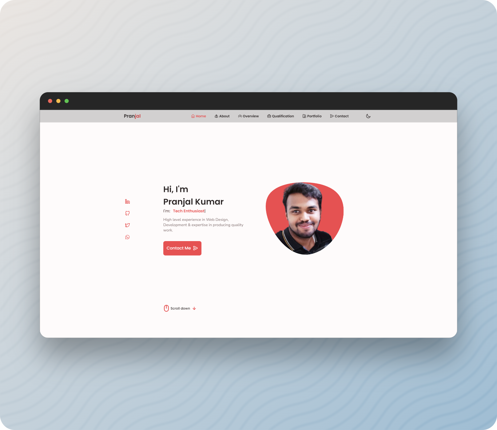

# Dockfolio

 

 &nbsp;
 &nbsp;
 

🔹
<a href="https://github.com/pranjal-barnwal/dockfolio/issues">**Report Bug**</a> &nbsp;
🔹&nbsp;
<a href="https://github.com/pranjal-barnwal/dockfolio/issues">**Request Feature**</a>
🔹

> ### Developer | Programmer | Designer 
Dockfolio brings the power of potency of portfolio which every developer needs with the super-powers of Docker

 

## License
[**MIT License**](https://github.com/pranjal-barnwal/dockfolio/blob/main/license)

## **Show your support**
Hit the ⭐ if you liked this website!

